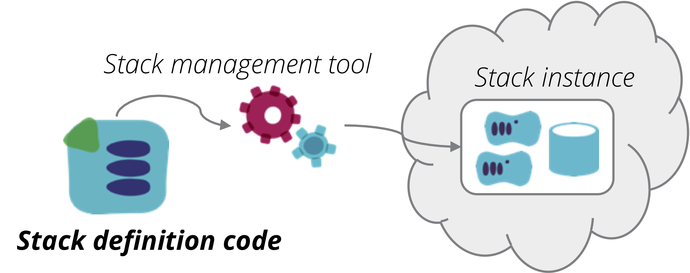

An *Infrastructure Stack* is a collection of infrastructure elements that is defined, provisioned, and updated as a unit. The elements of the stack are defined in *source code*, and may include a combination of compute, networking, and/or storage resources. A *stack management tool* reads the source code and interacts with an infrastructure platform to ensure the specified resources are provisioned as an *instance* of the stack.

<figure>
  
  <figcaption>Figure 1. An infrastructure stack is a collection of infrastructure elements managed as a unit.</figcaption>
</figure>

## Stack management tools

Examples of stack management tools include [Hashicorp Terraform](https://www.terraform.io/), [AWS CloudFormation](https://aws.amazon.com/cloudformation/), [Azure Resource Manager Templates](https://docs.microsoft.com/en-us/azure/azure-resource-manager/resource-group-overview), [Google Cloud Deployment Manager Templates](https://cloud.google.com/deployment-manager/) and [OpenStack Heat](https://wiki.openstack.org/wiki/Heat). Some toolchains designed to configure servers also have capabilities to manage stacks, for example [Ansible Cloud Modules](https://www.ansible.com/integrations/cloud), [Chef Provisioning](https://docs.chef.io/provisioning.html), [Puppet modules](https://forge.puppet.com/puppetlabs/aws/readme), and [Salt Cloud](https://docs.saltstack.com/en/latest/topics/cloud/).

### "Stack" as a term

These tools, and others like them, all define a collection of infrastructure in a declarative way, but they don't use a single common term to describe the collection. So for the purposes of cross-tool design patterns, we will use the term "stack". 

## Stack code project

Each stack has source code project that declares what infrastructure elements should be provisioned as a part of the stack. It may be a Terraform project, CloudFormation template, or code for another tool which manages cloud infrastructure as code. A stack project contains the source code that correlates to an instance of infrastructure. With Terraform, this relates to a statefile; with CloudFormation, it is a CloudFormation Stack, etc.

<figure>
  
  <figcaption>Figure 2. A stack source code project is used to provision stack instances.</figcaption>
</figure>

Below is an example stack source code project, in this case Terraform:

~~~ console
stack-project/
   ├── src/
   │   ├── dns.tf
   │   ├── load_balancers.tf
   │   ├── networking.tf
   │   └── webserver.tf
   └── test/
~~~

### Stack component modules

A [stack code module](stack-code-module.html) is a package of code that can be shared by multiple stack projects.

<figure>
  
  <figcaption>Figure 3. A stack code module packages code to be shared by multiple stack projects.</figcaption>
</figure>

## Stack instance

Each stack source code project can be used to provision one or more stack instances. When the relevant stack management tool is run, it reads the code and then interacts with the API of an infrastructure platform to either provision new infrastructure elements, or make changes to existing infrastructure elements. After running, the infrastructure elements should be consistent with the code.

If changes are made to the code and the tool is run again, then the existing infrastructure elements are changed accordingly. If the tool is run another time without any changes to the code, then the existing infrastructure elements will be left as is. The set of infrastructure elements managed together according to the code is the stack instance.

The [Singleton Stack antipattern](singleton-stack.html) is a naive implementation, where each stack instance is defined and managed by its own separate copy of the stack source code. This is useful for very simple use cases, particularly when learning something, but it isn't a suitable approach for important infrastructure.

## Multiple stack instances

A single stack code project may be used to provision and manage multiple stack instances. There are two main patterns for this, which address different use cases.

The first pattern for reusing a stack project's code is a [template stack](template-stack.html), which aims to ensure consistency across instances. The common uses for this are: to provide consistent environments for testing software and other system elements; to test changes to the infrastructure code itself; or to replicate system elements for scaling, geographic available, or resilience. There is very little variation between instances of the stack, since the intention is for them to be replicas of the same system elements.

<figure>
  
  <figcaption>Figure 4. Multiple stack instances can be provisioned from a single stack code project.</figcaption>
</figure>

The second pattern for reusing a stack project's code is a [library stack](library-stack.html), where stack code is reused to create multiple instances which have similar infrastructure elements, but which are used for different purposes. For example, code that defines a database cluster may be used to create one stack instance for a product service database, a second instance for a customer service database, and a third instance for a transaction service database. Unlike template stacks, two instances of a given library stack may be very different, since they may serve different purposes.

The typical way to create multiple stack instances from a single stack code project, whether it's a template or library stack, is to provide options to the stack management tool to give each stack instance a unique identity.

With CloudFormation, this is done by setting a different stack name for each instance. If you pass it a stack name that doesn't exist, the tool creates a new instance. If the stack name does exist, then the tool re-applies the code to the existing stack elements.

With Terraform, each stack instance has its own state file, which contains information used to map specific infrastructure elements provisioned in the platform to the code in the stack project. You pass arguments to the terraform command to tell it which statefile to use, so that it knows which stack instance to create or update.

> ## A note on state
> 
> A notable difference between Terraform and other infrastructure stack management tools is that Terraform uses an explicit [state file](https://www.terraform.io/docs/state/). This file contains data structures which identify which infrastructure elements actually provisioned in the infrastructure platform are part of that stack instance.
>
> 
> 
> Of course all stack management tools, including CloudFormation, etc., maintain similar data structures. However, tools implemented by the same vendor that implements the infrastructure platform are able to manage these data structures on the server side. These are transparent to the user, who only interacts with the vendor's API. 
> 
> Arguably, the explicit state management of Terraform gives you more control and transparency. When your CloudFormation stack gets wedged, you can't examine the state data structures to see what's happening. And you (and third parties) have the option of writing tools that use the state data for various purposes. But it does require you to put a bit more work into keeping track of statefiles and making sure they're available when running the stack management tool. Clearly, it's nicer if the data structures are maintained transparently for you, and never become corrupted or inconsistent.

Parameterizing stacks makes stack code more reusable, whether for template stacks or library stacks. There are a number of [patterns for configuring stacks](/patterns/stack-configuration/).

As the size and complexity of infrastructure grows, keeping it all in a single stack becomes messy and difficult to work with. There are various patterns that can be applied to organize infrastructure stacks to make them more manageable, which will be published in the future.
