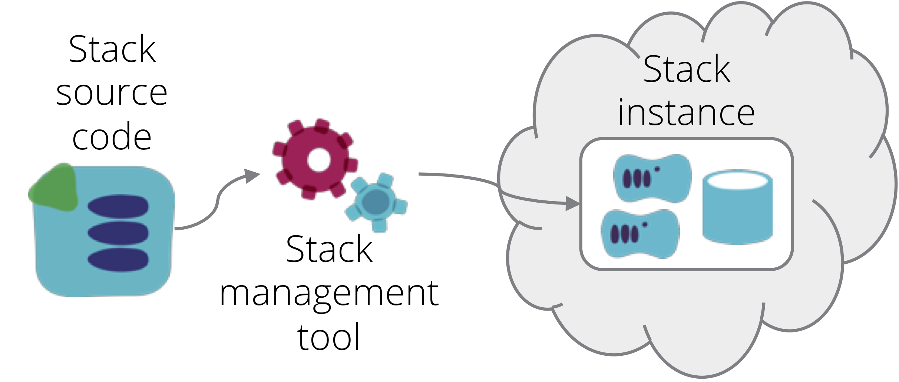

An *Infrastructure Stack* is a collection of infrastructure elements that are defined and managed as a single unit.

Infrastructure on a dynamic, IaaS platform is provisioned and managed as discrete units by tools such as [Hashicorp Terraform](https://www.terraform.io/), [AWS CloudFormation](https://aws.amazon.com/cloudformation/), [Azure Resource Manager Templates](https://docs.microsoft.com/en-us/azure/azure-resource-manager/resource-group-overview), [Google Cloud Deployment Manager Templates](https://cloud.google.com/deployment-manager/) and [OpenStack Heat](https://wiki.openstack.org/wiki/Heat). These tools (and others) all define a collection of infrastructure in a declarative way, and there are design patterns (and anti-patterns) that apply regardless of which one you work with. However, these tools and their documentation don't use a common term to describe the collection of infrastructure they work with, so for the purposes of cross-tool design patterns, we will use the term "[stack](http://infrastructure-as-code.com/patterns/2018/03/28/defining-stacks.html)".

## Stack definition

A stack definition is the code that declares what a stack should be. It is a Terraform project, CloudFormation template, and so on. A stack definition may use shared infrastructure code - for example, [CloudFormation nested stacks](https://aws.amazon.com/blogs/devops/use-nested-stacks-to-create-reusable-templates-and-support-role-specialization/) or [Terraform modules](https://www.terraform.io/docs/modules/index.html).

Below is an example stack definition, in this case a Terraform project:

~~~ console
stack-definition/
   ├── src/
   │   ├── backend.tf
   │   ├── bastion.tf
   │   ├── dns.tf
   │   ├── load_balancers.tf
   │   ├── networking.tf
   │   ├── outputs.tf
   │   ├── provider.tf
   │   ├── variables.tf
   │   └── webserver.tf
   └── test/
~~~

## Stack instance

A stack definition can be used to provision one or more stack instances. When the relevant stack management tool is run, it reads the stack definition and then interacts with the API of an infrastructure platform to either provision new infrastructure elements, or make changes to existing infrastructure elements. After running, the infrastructure elements should be consistent with the definition.

If changes are made to the definition and the tool is run again, then the existing infrastructure elements are changed accordingly. If the tool is run another time without any changes to the definition, then the existing infrastructure elements will be left as is. The set of infrastructure elements managed together according to the definition is the stack instance.

The [Singleton Stack antipattern](singleton-stack.html) is a naive implementation, where each stack instance is defined and managed by a separate stack definition. This is useful for very simple use cases, particularly when learning something, but it isn't a suitable approach for important infrastructure.

In most cases, a single stack definition will be used to provision and manage multiple stack instances. There are two main patterns for this, which address different use cases.

## Multiple stack instances

The first pattern for reusing a stack definition is a [template stack](template-stack.html), which aims to ensure consistency between instance created from a given stack definition. The common uses for this are: to provide consistent environments for testing software and other system elements; to test changes to the infrastructure code itself; or to replicate system elements for scaling, geographic available, or resilience. There is very little variation between instances of the stack, since the intention is for them to be replicas of the same system elements.

The second pattern for reusing a stack definition is a [library stack](library-stack.html), where a stack definition is used to create multiple instances with similar infrastructure elements, which used for different purposes. For example, an infrastructure stack that defines a database cluster may be used to create one stack instance for a product service database, a second instance for a customer service database, and a third instance for a transaction service database. Unlike template stacks, instances of library stacks may be very different, since they may serve different purposes.

The typical way to create multiple stack instances from a single stack definition is to provide options to the stack management tool to give the stack instance a unique identity. With CloudFormation, this is done by passing a different stack name for each instance. If you pass it a stack name that doesn't exist, the tool creates a new instance. If the stack name does exist, then the tool applies the definition to the existing stack elements.

With Terraform, each stack instance has its own state file, which contains information used to map specific infrastructure elements provisioned in the platform to the stack definition (the Terraform project). You pass arguments to the terraform command to tell it which statefile to use, so that it knows which stack instance to create or update.

> ## A note on state
> 
> A notable difference between Terraform and other infrastructure stack management tools is that Terraform uses an explicit [state file](https://www.terraform.io/docs/state/). This file contains data structures which identify which infrastructure elements actually provisioned in the infrastructure platform are part of that stack instance.
>
> 
> 
> Of course all stack management tools, including CloudFormation, etc., maintain similar data structures. However, tools implemented by the same vendor that implements the infrastructure platform are able to manage these data structures on the server side. These are transparent to the user, who only interacts with the vendor's API. 
> 
> Arguably, the explicit state management of Terraform gives you more control and transparency. When your CloudFormation stack gets wedged, you can't examine the state data structures to see what's happening. And you (and third parties) have the option of writing tools that use the state data for various purposes. But it does require you to put a bit more work into keeping track of statefiles and making sure they're available when running the stack management tool. Clearly, it's nicer if the data structures are maintained transparently for you, and never become corrupted or inconsistent.

Parameterizing stacks makes stack definition code more reusable, whether for template stacks or library stacks. There are a number of patterns for [configuring stack instances](../stack-configuration/).

As the size and complexity of infrastructure grows, keeping it all in a single stack becomes messy and difficult to work with. There are various patterns that can be applied to [organize infrastructure stacks](../stack-structures/) to make them more manageable.

