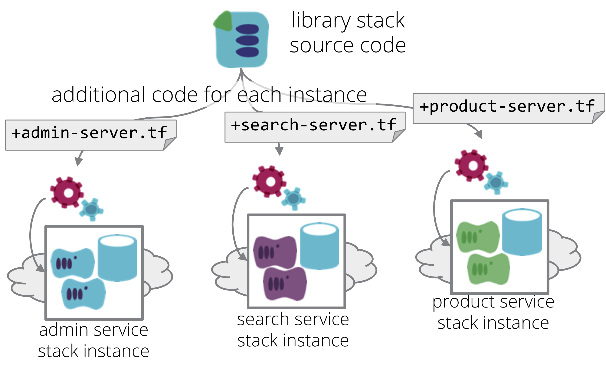

A Library Stack is an [infrastructure stack](/patterns/core-stack/) that is designed to be used as a base to create more specialised stacks.

Often, multiple infrastructure stacks are needed which are largely similar, but require customisation. For example, an organisation may run multiple applications which each require a database and a pool of servers behind a firewall. However, the servers will be configured differently, perhaps using different base images, and may run different code to install and configure the applications on each.

In this situation, a base stack definition could include most of the common infrastructure code, such as networking, database provisioning, and basic server provisioning. For each instance, additional code could be added to customize the server provisioning to deploy and configure the relevant application.

## Comparison with the template stack pattern

A library stack is similar to a [template stack](template-stack.html), in that a single definition is used to create multiple stack instances. The implementation may also be very similar. For example, a template stack may be customized by passing a handful of parameters. Our example of the application service stacks could be implemented by passing the name of a different server role to each instance, which is then used by provisioning code to apply a completely different set of server-level configuration.

The difference between a library stack and a template stack is the intent. A template stack is used to create multiple copies of essentially the same stack instance. A library stack is used to create stack instances which have different purposes. Each instance of a template stack would be expected to run the same application, whereas instances of a library stack may run different applications.

The main reason for defining these as two separate patterns is to clearly emphasize the intention of a given stack definition. If the intention is to replicate infrastructure, e.g. to manage multiple environments to test and run an application, then describing it as a template stack should make it easier to keep the design clean and focused.

Because of this difference, it's common for to implement a library stack in a way that enables significant variations between instances, as opposed to a template stack which aims to minimize differences between instances.

## Implementation

As mentioned, a simple method for customizing instances of a library stack is to pass variables when applying the stack definition, which the stack definition code uses to customize the infrastructure. However, it may be useful to customize instances further. In some cases, this could be done by taking a copy of the template stack definition, and adding additional infrastructure code (e.g. Terraform or CloudFormation files). When the stack management tool is run, it applies all of the code together - the code from the library stack as well as the added code which customizes the instance.

The following is an example Terraform project structure for a library stack. It defines a load balancer, networking, and database:

~~~ console
service-library-stack/
   ├── src/
   │   ├── load_balancer.tf
   │   ├── networking.tf
   │   └── database.tf
   └── test/
~~~

Another definition project contains the code for a particular application's servers:

~~~ console
search-service-stack-additions/
   ├── src/
   │   └── search-servers.tf
   └── test/
~~~

To apply the stack instance, these two projects are combined:

~~~ console
search-service-stack-full/
   ├── src/
   │   ├── search-servers.tf
   │   ├── load_balancer.tf
   │   ├── networking.tf
   │   └── database.tf
   └── test/
~~~

Generally speaking, few (if any) infrastructure stack tools support this structure naturally. It is generally implemented by teams using stack orchestration tools (which will be described in future content in this pattern catalogue).

Another way to implement a library stack is through stack modules. The main code is defined in a module, which is imported into a stack project which includes code to add the customizations. This is very similar to the [wrapper stack] pattern, which will be described in a future entry to these patterns.

## How stack modules relate to library stacks

A [stack module] is infrastructure code that is packaged to be re-used by multiple stack definitions. For example, a module may contain code that defines a block storage device (a mountable hard drive, such as an EBS volume on AWS). A stack definition can reference this module, probably passing some parameters, to provision an EBS volume.

Stack modules are mechanisms provided by specific stack management tools. Terraform has [modules](https://www.terraform.io/docs/modules/index.html), Cloudformation has [nested stacks](https://aws.amazon.com/blogs/devops/use-nested-stacks-to-create-reusable-templates-and-support-role-specialization/), etc.

In practice, there is not much difference between a stack module and a library stack. The main difference is that a library stack is intended to represent a mostly complete stack, whereas a stack module is usually a smaller component designed to be included in a stack. A stack definition might include multiple modules, maybe even the same one. For example, a stack that creates a set of servers to run an application might use a "disk volume module" several times, to create different disks for different servers in the stack.

