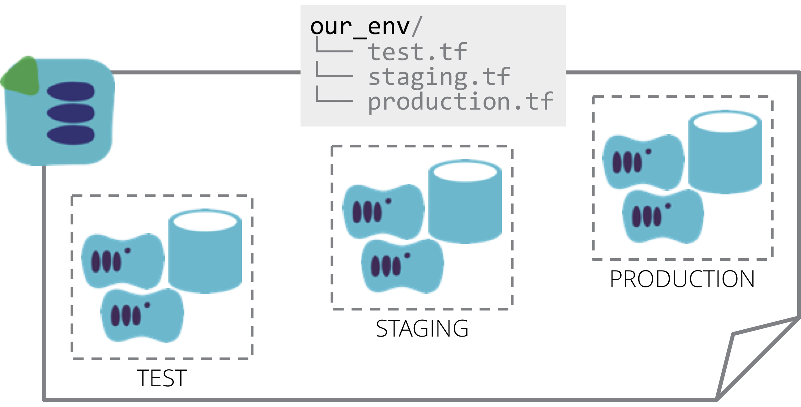

A Many-Headed Stack manages the infrastructure for multiple environments in a single stack.

For example, if there are three environments for testing and running an application, a single Terraform project (and single statefile) includes the code for all three of the environments.

Many people new to an infrastructure stack tool start out by creating this type of structure, because it seems natural to simply add new environments into a project that already exists. But a bit of experience shows the drawbacks of the approach.

The problem with including multiple environments in a single stack is that when the tool is run to apply the definition to the deployed infrastructure, its scope is everything in the stack. So if you apply a change to the "test" environment in the example above, it's entirely possible that changes will be inadvertently made to "staging" or "production" environments. 

This can happen when the person applying the definition to change one environment doesn't realize that unfinished changes have been made to the code for another environment. Sometimes someone starts making a change, then is interrupted before applying it, and later forgets about it.

In other cases, there are dependencies across elements in the stack definition, especially where code or variables are shared across environments. So a change that we think should only affect one environment actually trigger changes to another. This illustrates another issue with this antipattern, it's harder to enforce decoupling between pieces of code within a single stack definition.

Certain operational problems can also affect multiple environments managed as a single stack. Corruption to data structures (e.g. in Terraform statefile, or in CloudFormation stack data) impacts all of the environments in the stack.

The term "blast radius" is used to describe the potential scope for damage of a particular change. For infrastructure stacks, the blast radius for a change includes everything within the stack.

## Alternative patterns

Therefore, it's a good idea to limit the blast radius, and reduce risk of change, by splitting environments into separate stacks. One obvious way to do this is the [singleton stack](singleton-stack.html), where each environment has its own separate stack definition, although this is considered an anti-pattern.

A better approach is the [template stack](template-stack.html) pattern, where a single definition is used to define an environment, and then applied to manage a separate stack instance for each environment. Although this involves using a single definition, the advantage is that the definition is only applied to one environment instance at a time. So the blast radius for changes are limited to that one environment.
