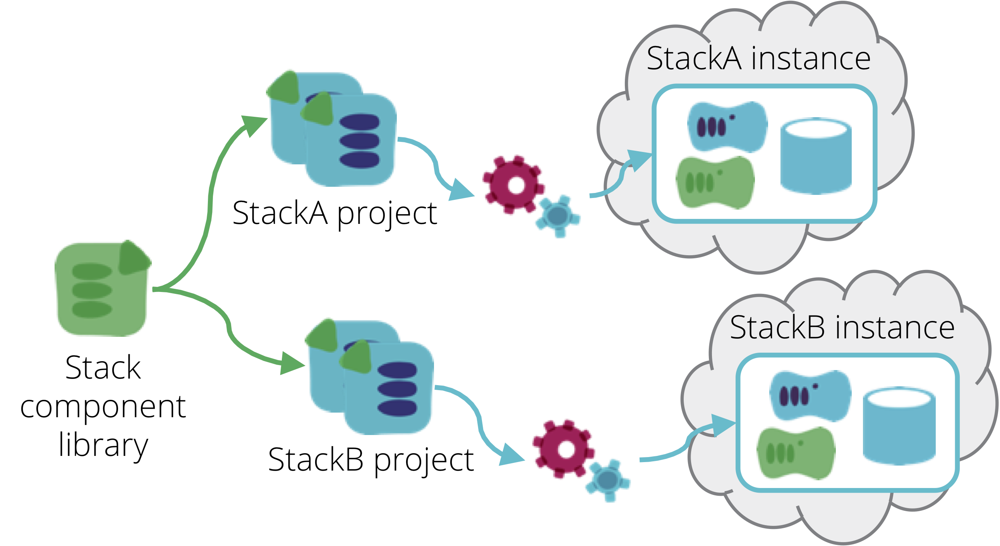

A Stack Code Module is infrastructure code that can be included into one or more [infrastructure stack](/patterns/core-stack/) projects.

Most stack management tools implement modularization for re-use. Terraform has [modules](https://www.terraform.io/docs/modules/index.html), Cloudformation has [nested stacks](https://aws.amazon.com/blogs/devops/use-nested-stacks-to-create-reusable-templates-and-support-role-specialization/), etc.

<figure>
  
  <figcaption>A Stack Code Module is a unit of infrastructure code that can be included into one or more infrastructure stack projects.</figcaption>
</figure>

The use case for stack code modules is to re-use code across stacks, and in some cases within stacks. For example, a stack that includes a pool of web servers and a pool of application servers could re-use a "load balancer" module to create two load balancer VIPs, one in front of each server pool.

A stack code module has some similarities to a [library stack](library-stack.html). A library stack normally represents a complete stack, or nearly complete stack, which is customized for different purposes, whereas a stack code module is typically a smaller unit of code that is included within a larger stack project. This distinction is subjective in theory, but in practice code modules are a feature of stack management tools, whereas library stacks tend to be a usage pattern implemented by teams writing infrastructure code.

The [wrapper stack](/patterns/stack-configuration/wrapper-stack.html) pattern makes use of stack code modules in a variation of the library stack and [template stack](template-stack.html) pattern.

Other types of infrastructure tools, for example server configuration tools like Ansible, Chef, and Puppet, also have module or library functionality to enable shared code. This pattern, however, specifically refers to sharing code between stack projects.

## Pitfalls of stack code modules

Some teams use stack code modules as a way to organize code that isn't actually shared. The code in a stack project is split out into separate modules, each of which is only used in that project. The issue with this is that modularization adds complexity, such as versioning and integration testing. This complexity is fine when it serves the purpose of enabling code reuse. But if the only purpose of modularizing is to make the code seem more organized, there are better ways. Code for a stack can usually be organized into separate files, and even folders, within a single project. If this leads to a significant number of files and folders, then this is a hint that the stack has become a [monolithic stack](/patterns/stack-structures/monolithic-stack.html).

Another challenge with modularization is that it can create tight coupling across stacks. It should be possible to make changes to a module without disrupting stacks which don't need the particular change. If changes to modules are either disruptive, or require significant coordination work, then the design should be reconsidered.

In many cases, a module that defines a common thing (for example, a server instance module) is used in significantly different ways for different things. If a module has significant code to handle different scenarios (web servers vs. database servers vs. cluster hosts), it's probably better to extract different modules, or even unpack the module and declare infrastructure directly in the stack code. Infrastructure designers shouldn't feel constrained to force things into modules because they use a fundamentally similar underlying construct such as a server. Instead, modules should be shared when they serve the same outcome.

A related issue is anaemic stack code modules, which do very little beyond wrapping underlying constructs. For example, a server instance module which takes essentially all of the same parameters as the underlying infrastructure code to create a server. This is often seen as beneficial, because it "abstracts" the specific code. But in practice, it simply creates more code to maintain.

