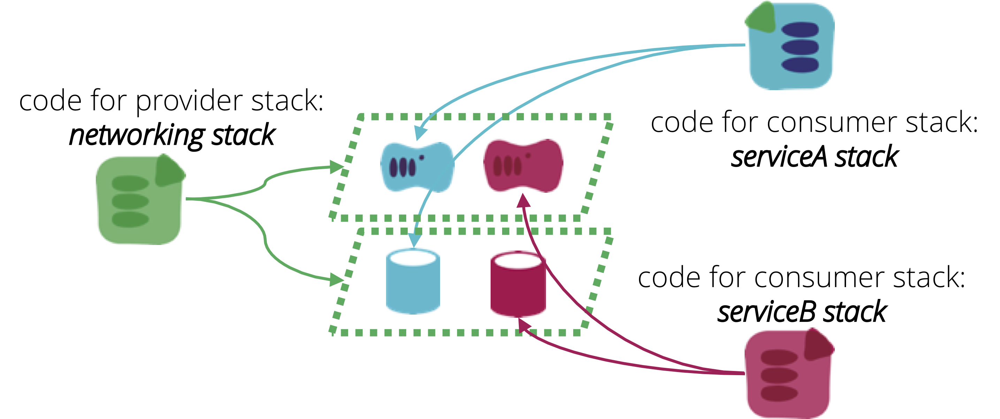

A Shared Infrastructure [stack](/patterns/core-stack/) includes infrastructure elements that are used by other stacks.

For example, the stack might provision a VPC with several subnets. Other stacks can then define servers and assign them to those subnets. The first stack - the one which creates infrastructure for use by other stacks - is referred to as a *Provider* stack. Stacks which use elements from a provider stack are called *Consumer* stacks.

<figure>
  
  <figcaption>A Shared Infrastructure stack includes infrastructure elements that are used by other stacks.</figcaption>
</figure>

Shared stacks can be useful to reduce duplication - a set of common subnets can be created once, and then used by multiple stacks, rather than each of the other stacks needing to create its own subnets.

In some cases, sharing infrastructure between stacks is useful to support communication and data interchange between processes running within those stacks. For example, if two different consumer stacks provision servers, and those servers run applications which need to communicate with each other, it can help to assign the servers to a single, shared subnet.

There are a number of mechanisms for [integrating different stacks](/patterns/stack-integration/).

## Avoid circular dependencies

It is a good design principle to ensure that dependencies between stacks only go in one direction. That is, if stack A depends on something in stack B, then stack B should not depend on anything in stack A. A violation of this principle is known as a *circular dependency*. Circular dependencies make it difficult and messy to apply changes.

Another way to put this is that a provider stack should not have any awareness of its consumer stacks.

## Ensuring clean boundaries

Another concern is that anything shared between stacks represents a coupling point. Systems with multiple stacks can easily become tangled and difficult to maintain. To prevent this from becoming a problem, all points of integration between stacks should be clearly defined, and designs should keep these points minimal and simple.

