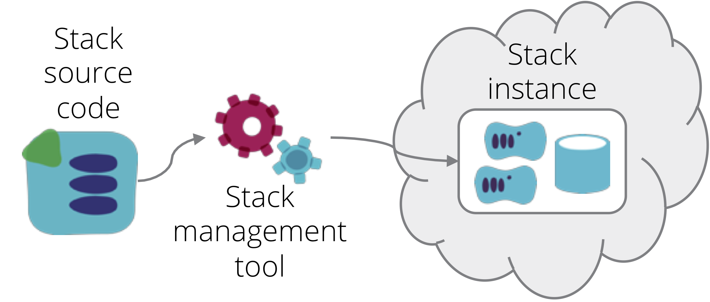
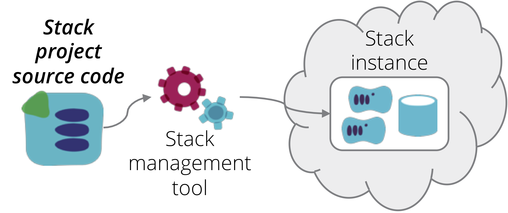
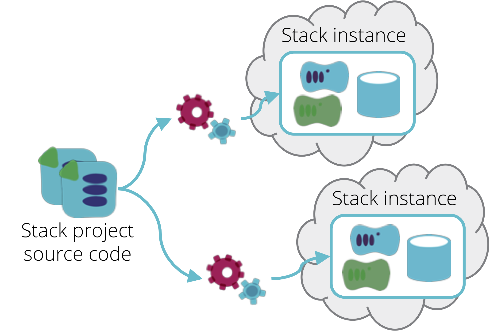

An *Infrastructure Stack* is a collection of infrastructure elements that is defined, provisioned, and updated as a unit. The elements of the stack are defined in *source code*, and may include a combination of compute, networking, and/or storage resources. A *stack management tool* reads the source code and interacts with an infrastructure platform to ensure the specified resources are provisioned as an *instance* of the stack.

<figure>
  
  <figcaption>Figure 1. An infrastructure stack is a collection of infrastructure elements managed as a unit.</figcaption>
</figure>

Examples of stack management tools include [Hashicorp Terraform](https://www.terraform.io/), [AWS CloudFormation](https://aws.amazon.com/cloudformation/), [Azure Resource Manager Templates](https://docs.microsoft.com/en-us/azure/azure-resource-manager/resource-group-overview), [Google Cloud Deployment Manager Templates](https://cloud.google.com/deployment-manager/) and [OpenStack Heat](https://wiki.openstack.org/wiki/Heat). Some toolchains designed to configure servers also have capabilities to manage stacks, for example [Ansible Cloud Modules](https://www.ansible.com/integrations/cloud), [Chef Provisioning](https://docs.chef.io/provisioning.html), [Puppet modules](https://forge.puppet.com/puppetlabs/aws/readme), and [Salt Cloud](https://docs.saltstack.com/en/latest/topics/cloud/).

> ### "Stack" as a term
>
> These tools, and others like them, all define a collection of infrastructure in a declarative way, but they don't use a single common term to describe this collection. Different people may use or prefer different terms, but for the purposes of cross-tool design patterns, this catalogue and related material will use the term "stack".

## Stack code project

Each stack has source code that declares what infrastructure elements should be included in the stack. The source code could be a Terraform project, CloudFormation template, or code for another tool which manages cloud infrastructure as code. A *stack project* contains the source code that defines the infrastructure for a stack. With Terraform, this correlates to a statefile for each instance of the stack; with CloudFormation, it is a CloudFormation Stack, etc.

<figure>
  
  <figcaption>Figure 2. A stack source code project is used to provision stack instances.</figcaption>
</figure>

Below is an example of a folder structure for a stack source code project, in this case Terraform:

~~~ console
stack-project/
   ├── src/
   │   ├── dns.tf
   │   ├── load_balancers.tf
   │   ├── networking.tf
   │   └── webserver.tf
   └── test/
~~~

### Stack component modules

A [stack code module](/patterns/stack-concept/stack-code-module.html) is a package of code that can be shared by multiple stack projects.

<figure>
  
  <figcaption>Figure 3. A stack code module packages code to be shared by multiple stack projects.</figcaption>
</figure>

([Read more about stack code modules](/patterns/stack-concept/stack-code-module.html))

## Stack instance

Each stack source code project can be used to provision one or more stack instances. When the relevant stack management tool is run, it reads the code and then interacts with the API of an infrastructure platform to either provision new infrastructure elements, or make changes to existing infrastructure elements. The act of running the infrastructure tool *applies* the stack source code to the stack instance. After the source code is applied, the infrastructure elements in the instance should be consistent with the code.

If changes are made to the code and the tool is run again, then the existing infrastructure elements are changed accordingly. If the tool is run another time without any changes to the code, then the existing infrastructure elements will be left as is.

> This characteristic, being able to apply the same code to an instance repeatedly and getting the same result (as opposed to creating more and more infrastructure elements each time) is called [idempotency](https://en.wikipedia.org/wiki/Idempotence).

### Singleton stacks

The [Singleton Stack](/patterns/stack-replication/singleton-stack.html) is a naive implementation, where each stack instance is defined and managed by its own separate copy of the stack source code. This is useful for very simple use cases, particularly when learning something, but it isn't a suitable approach for important infrastructure.

<figure>
  
  <figcaption>Figure 4. A singleton stack has a separate copy of the source code project for each instance.</figcaption>
</figure>

([Read more about singleton stacks](/patterns/stack-replication/singleton-stack.html))

### Template stacks

Alternately, a single stack code project may be used to provision and manage multiple stack instances. A [template stack](/patterns/stack-replication/template-stack.html) is implemented in a way that makes it easy to create multiple instances.

Common uses for creating multiple instances from a single code project include: to provide consistent environments for testing software and other system elements; to test changes to the infrastructure code itself; or to replicate system elements for scaling, geographic available, or resilience.

<figure>
  
  <figcaption>Figure 5. Multiple stack instances can be provisioned from a single stack code project.</figcaption>
</figure>

The typical way to create multiple stack instances from a single stack code project is to provide options to the stack management tool to give each stack instance a unique identity.

~~~ console
terraform apply -var 'instance_id=A'
terraform apply -var 'instance_id=B'
~~~

With CloudFormation, this is done by setting a different stack name for each instance. If you pass it a stack name that doesn't exist, the tool creates a new instance. If the stack name does exist, then the tool re-applies the code to the existing stack elements.

Terraform uses a separate state file for each stack instance. The state file contains information used to map specific infrastructure elements provisioned in the platform to the code in the stack project. You pass arguments to the terraform command to tell it which statefile to use, so that it knows which stack instance to create or update.

[Read more about template stacks](/patterns/stack-replication/template-stack.html)

> ## A note on state
> 
> A notable difference between Terraform and other infrastructure stack management tools is that Terraform uses an explicit [state file](https://www.terraform.io/docs/state/). This file contains data structures which identify which infrastructure elements actually provisioned in the infrastructure platform are part of that stack instance.
>
> 
> 
> Of course all stack management tools, including CloudFormation, etc., use mechanisms to handle the mapping of elements defined in source code to the actual instances of the infrastructure elements. Tools implemented by an infrastructure vendor are able to maintain these mappings on the server side, so they are transparent to the user, who only interacts with the vendor's API. 
> 
> Arguably, the explicit state management of Terraform gives you more control and transparency. When your CloudFormation stack gets wedged, you can't examine the state data structures to see what's happening. And you (and third parties) have the option of writing tools that use the state data for various purposes. But it does require you to put a bit more work into keeping track of statefiles and making sure they're available when running the stack management tool. Clearly, it's nicer if the data structures are maintained transparently for you, and never become corrupted or inconsistent.

### Configuring and splitting stacks

Instances of a template stack often need to be configured to reflect differences. This may be to give each instance distinct identifiers and names. Configuration may also support useful variations between the instances, such as sizing of clusters. There are several [patterns for configuring stacks](/patterns/stack-configuration/).

As the size and complexity of infrastructure grows, keeping it all in a single stack becomes messy and difficult to work with. There are various patterns that can be applied to [split up infrastructure stacks](/patterns/multiple-stacks/) to make them more manageable.

When systems are spread across multiple infrastructure stacks in this way, they tend to have dependencies between them. There are a number of stack integration patterns which can be used for this, which will be documented here in the future.

Running a stack tool by hand works well for a single, fairly simple stack. As systems become more complex, with multiple stacks, multiple instances, then configuring them and passing integration information can become challenging. Most teams deal with this by writing [orchestration tools](/patterns/stack-orchestration-tools/) in some scripting language.

