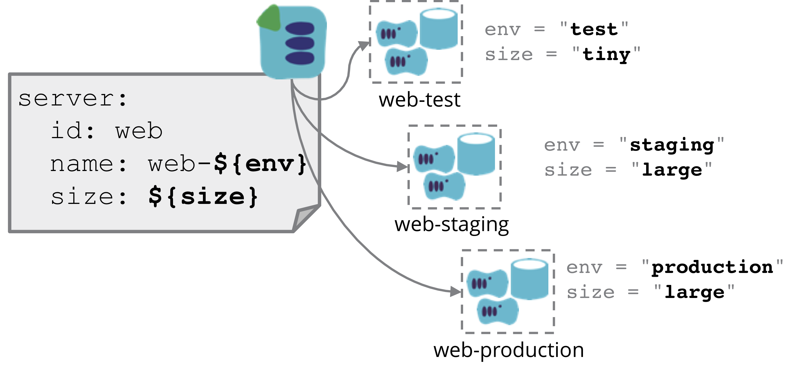

Defining an [infrastructure stack](/patterns/core-stack/) as code enables the creation of multiple instances of the stack. There is usually a need to define some aspects of the stack differently for different instances - at the least, different names, identifiers, and/or tags are needed to distinguish the different instances. There are different techniques for setting configuration for instances of a stack.

## Typical uses for configuring stack instances differently

As described in the [core patterns](/patterns/core-stack), there are two main patterns used to create multiple stack instances from a single stack definition. One is a [template stack](/patterns/core-stack/template-stack.html), where all of the instances created from a stack definition are intended to be highly consistent. There should be very little variation between them. The common case of this is when creating stack instances to test software - the same stack definition is used to create instances for development, test, and production, so that the software is tested in an environment that is consistent with production.

The other pattern is the [library stack](/patterns/core-stack/library-stack.html), where the stack definition provides the core configuration for the stack's infrastructure, but each instance is customized or extended to serve different purposes. An example of this is defining a stack that creates a database cluster, but provisioning instances with different configurations for a product database, user database, and search database.

Because instances of a template stack tend to have little variation - in fact, it's desirable to keep variation to a minimum - configuration tends to be limited to a handful of simple parameters - strings, numbers, lists, key-value maps. So the configuration mechanism for these can be fairly simple, essentially a way to pass a set of variable names and values to the tool when provisioning or updating the stack instance.

Library stacks, on the other hand, often need deeper customization. This might involve providing more complex data structures, large blobs of data (e.g. passing scripts to be executed), or even adding additional infrastructure code (e.g. adding a terraform file to the project before applying it).

## Stack configuration mechanisms

In order to create instances of a parameterized stack, a mechanism is needed to provide parameter values. Some options include [Stack Parameter Files], [Pipeline-defined parameters], and [Parameter Registry]. Descriptions of these patterns are upcoming.

Another approach is to define the stack as a module, and then use a [Wrapper Stack](wrapper-stack.html) to define parameter values for each instance.

## Related topics

When a system's infrastructure is divided across multiple stacks, configuration usually needs to be passed from one stack to another. The mechanisms for doing this are closely related to those for per-instance configuration, although there are additional things to consider. This is discussed under [stack integration](/patterns/stack-configuration/).

