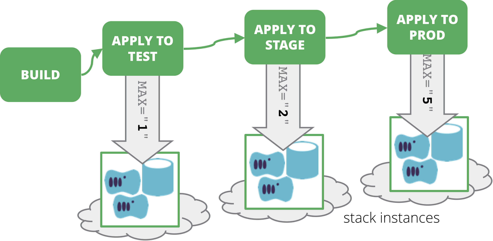

When instances of a [template stack](/patterns/stack-replication/template-stack.html) is managed using a Continuous Delivery Pipeline, stack instance values can be defined in pipeline job configuration. Each stage which applies the stack code to a given environment includes configuration values for that environment, which is then passed to the command which applies to the code.

<figure>
  
  <figcaption>Each stage which applies the stack code passes the configuration values for the environment.</figcaption>
</figure>

## Motivation/Applicability

Using a pipeline to manage instances of a [template stack](/patterns/stack-replication/template-stack.html) helps to ensure changes are delivered consistently across all of the instances. Defining instance parameters in the pipeline stage for each instance is an obvious and natural approach to leverage the tools and patterns already being used.

## Consequences

The process for changing the configuration of a particular instance is to change the pipeline stage configuration. In any case, defining pipelines as code is a good idea. But when the pipeline also defines aspects of the environments, the case for this is even stronger, as it ensures infrastructure configuration is fully visible, traceable, and repeatable.

## Implementation

As an example, a stack that is used to create a web server cluster may have different values for the sizing of the cluster in different environments:

| Stack Instance | environment_id | cluster_minimum | cluster_maximum |
|-------|--------|---------|
| webserver_test | test | 1 | 1 |
| webserver_staging | staging | 1 | 2 |
| webserver_production | production | 2 | 5 |

The pipeline job configuration could specify the command line for running the stack management tool, passing the parameter values on the commandline. This essentially implements the [command-line parameter pattern](command-line-parameters.html).

This pattern could also be used in conjunction with the [stack instance configuration file pattern](stack-instance-configuration-file.html), passing the path to the relevant configuration file to the stack management tool on its command line.

Or, the pipeline job could pass an *environment_id* value to the stack management tool, or to the [orchestration tool](/patterns/stack-orchestration/), that is then used to look up the needed parameter values for the instance in a [parameter registry](stack-parameter-registry.html).

Generally speaking, these later approaches are preferable, because it keeps the pipeline configuration from becoming overly complicated.

