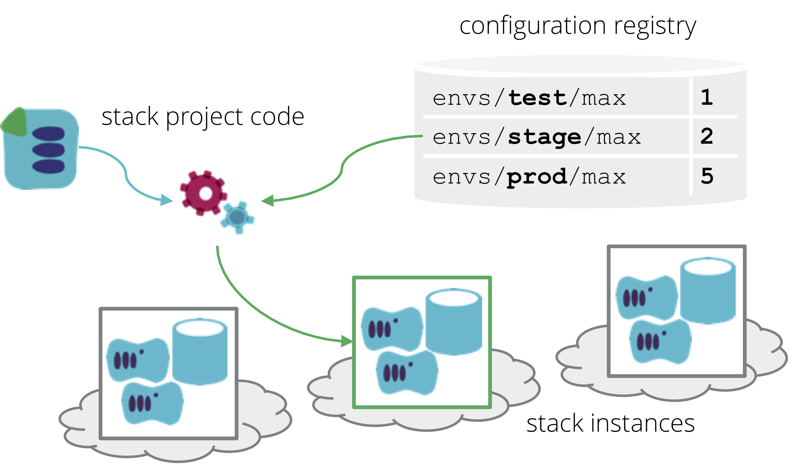

Stack instance configuration values can be stored in a parameter registry. The appropriate set of values can be retrieved from the registry by the stack management tool or [stack orchestration tool](/patterns/stack-orchestration-tools/) when applying the code to a stack instance.

<figure>
  
  <figcaption>Stack instance configuration values can be stored in a parameter registry.</figcaption>
</figure>

This is normally used with a [template stack](/patterns/stack-replication/template-stack.html), which has parameters that can be set differently for different instances of the stack. For example, a stack that is used to create a web server cluster may have different values for the sizing of the cluster in different environments:

| Stack Instance | environment_id | cluster_minimum | cluster_maximum |
|-------|--------|---------|
| web_test | test | 1 | 1 |
| web_staging | staging | 1 | 2 |
| web_production | production | 2 | 5 |

A configuration registry is usually a key-value store, ideally with a folder-like structure for storing variables and values. So the values for the example above might be stored in a structure like this:

~~~ console
└── environment_id
    ├── test
    │   ├── web
    │   │    ├── cluster_minimum = 1
    │   │    └── cluster_maximum = 1
    │   └── app
    │        ├── cluster_minimum = 1
    │        └── cluster_maximum = 1
    ├── staging
    │   ├── web
    │   │    ├── cluster_minimum = 1
    │   │    └── cluster_maximum = 2
    │   └── app
    │        ├── cluster_minimum = 2
    │        └── cluster_maximum = 3
    └── production
        ├── web
        │    ├── cluster_minimum = 2
        │    └── cluster_maximum = 3
        └── app
             ├── cluster_minimum = 2
             └── cluster_maximum = 5
~~~

When applying the infrastructure stack code to an instance, an ID such as *environment_id* is used to find the appropriate values for that instance. Here's an example of code to retrieve a value:

~~~ hcl
data "registry_value" "web_cluster_minimum" {
  path "/environment_id/${var.environment_id}/web/cluster_minimum"
}
~~~

So the single variable `environment_id` can be used as an input to the stack code, and then used to retrieve all of the other values needed. Alternatively, a [stack orchestration tool](/patterns/stack-orchestration-tools/) might be used which retrieves the values from the registry and passes them to the stack management tool, which is an example of dependency injection (which will be described in a future pattern).

## Comparison with alternatives

A configuration registry is usually more complex to implement than other configuration patterns. It may involve provisioning and maintaining an additional service, adopting a service hosted by a third party, or using a platform-specific service (see below for discussions of registry implementations).

In any of these cases, the registry service is a dependency, and a potential point of failure. If the registry becomes unavailable, it is normally impossible to reprovision or update infrastructure stacks. This can be painful in disaster recovery scenarios, which puts the registry service on the critical path for restoring or moving services in an emergency.

A potential benefit of a configuration registry is that it makes configuration centrally visible. The configuration data in a registry may be combined with other data so that it can be used as a Configuration Management Database, giving realtime visibility of systems and services that are currently running. If the registry provides tracking and control features such as history and authentication, it can support strong auditing and compliance regimes.

In more complex systems with multiple infrastructure stacks, the configuration registry can also be used for (/patterns/stack-integration/). It is then possible for different tools and services to make use of the registry to discover information needed to integrate and manage different parts of the system.

## Configuration registry implementations

A configuration registry is essentially a key/value store. There are many products which can be used to provide this service, as well as hosted services. Most cloud platforms, and many related systems such as container orchestration platforms, offer out of the box key/value stores, such as AWS SSM Parameter Store.

It's also possible to implement a simple configuration registry by storing files on a reliable storage, such as a hosted block storage service or a version control system. This can potentially resemble [stack instance configuration files](stack-parameter-files.html), with the difference that files are hosted separately from the stack project code.

