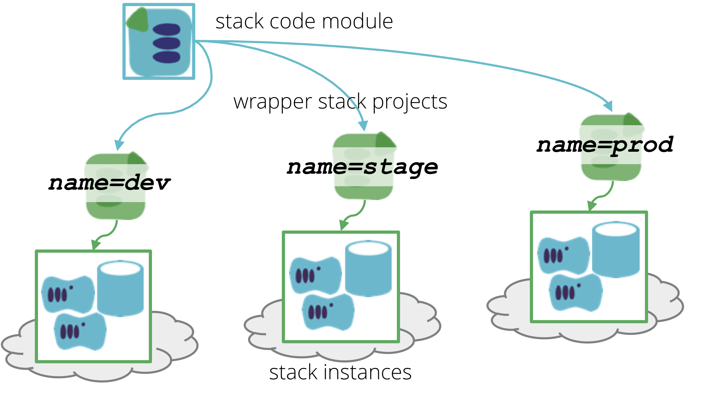

A Wrapper Stack is an [infrastructure stack definition](/patterns/core-stack/) which is used to import stack code from a module, and pass configuration values for a specific stack instance. This is essentially a mechanism to [configure stacks].

## Implementation

The implementation of wrapper stacks tend to look like [singleton stacks](/patterns/core-stack/singleton-stack.html), in that each stack instance has its own stack definition. The difference is that the per-instance wrapper stack has very little code in it.

The code that defines the infrastructure elements in the stack instances is maintained in a module, so there is a single copy of the code used by all instances, as with a [template stack](/patterns/core-stack/template-stack.html). The wrapper stack definition itself contains only configuration parameters for the specific instance of the stack. So this pattern can be seen as an alternative way to implement a template stack.§

In some cases, wrapper stacks may be used to customize a core stack definition to a wider extent than passing configuration parameters, essentially turning into the [library stack pattern](/patterns/core-stack/library-stack.html). This may be appropriate, as long as the intention is for each of the different stack instances to be used for different purposes.

When the instances are intended to be duplicates of the same infrastructure, as with environments used for testing and delivering applications, this kind of variation between instances tends to create inconsistency across environments, diluting their value for accurate replication. In these cases, each wrapper stack should be kept minimal, used strictly as a configuration mechanism rather than a way to extend or alter the core stack structure.

## Tools

The wrapper stack pattern is supported by tools such as [Terragrunt](https://github.com/gruntwork-io/terragrunt), which also acts as a [stack orchestration tool].
