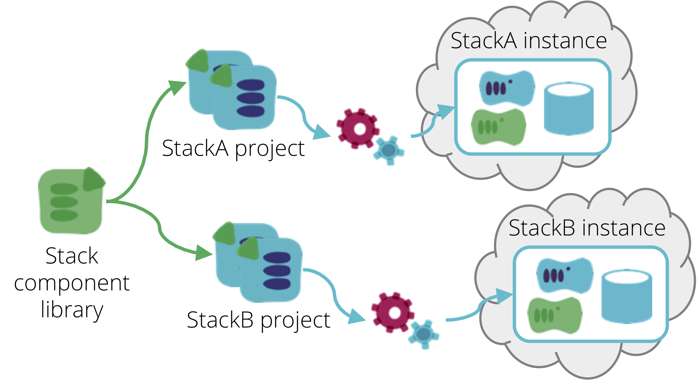

Most organisations need to run multiple copies of infrastructure, whether it's multiple environments for testing a system, or separate instances of an application for different customers. This pattern catalogue describes the concept of an [infrastructure stack](/patterns/stack-concept/) as a collection of infrastructure defined and provisioned as a unit - a Terraform project, CloudFormation stack, etc. There are different ways to replicate infrastructure in relation to these stacks. Some of these ways are useful, which are described here as patterns. Other ways are best avoided, which are described as antipatterns.

## [Template stack pattern](template-stack.html)

With the [template stack pattern](/patterns/stack-replication/template-stack.html), a stack source code project is implemented so that it can be used to create multiple instances of the stack, in a consistent way.

<figure>
  
  <figcaption>Figure 1. A Template Stack is an infrastructure stack project that is designed to be replicated consistently.</figcaption>
</figure>

## [Singleton stack antipattern](singleton-stack.html)

The [singleton stack antipattern](singleton-stack.html) is a naive implementation, where each stack instance is defined and managed by its own separate copy of the stack source code. This is useful for very simple use cases, particularly when learning something, but it isn't a suitable approach for important infrastructure.

<figure>
  
  <figcaption>Figure 2. A singleton stack has a separate copy of the source code project for each instance.</figcaption>
</figure>

## [Many-headed stack antipattern](many-headed-stack.html)

A Many-Headed Stack defines multiple copies of infrastructure in a single stack project. For example, if there are three environments for testing and running an application, a single Terraform project (and single statefile) includes the code for all three of the environments.

<figure>
  
  <figcaption>Figure 3. A many-headed stack manages the infrastructure for multiple environments in a single stack project.</figcaption>
</figure>

## [Stack code module pattern](stack-code-module.html)

A [stack code module](stack-code-module.html) is infrastructure code that can be included into one or more [infrastructure stack](/patterns/stack-concept/) projects. Most stack management tools implement modularization for re-use. Terraform has [modules](https://www.terraform.io/docs/modules/index.html), Cloudformation has [nested stacks](https://aws.amazon.com/blogs/devops/use-nested-stacks-to-create-reusable-templates-and-support-role-specialization/), etc.

<figure>
  
  <figcaption>Figure 4. A Stack Code Module is a unit of infrastructure code that can be included into one or more infrastructure stack projects.</figcaption>
</figure>

The difference between a stack code module and a template stack is that a module is code that is included into multiple stack projects, so that it can be re-used. A template stack is a complete stack project, which can be used to create multiple instances. Generally speaking, a module defines a smaller set of elements, that is not useful on its own. However, the [wrapper stack pattern](/patterns/stack-configuration/wrapper-stack.html) is an implementation where an entire stack is defined within a module, using separate stack projects to provide per-instance configuration.

