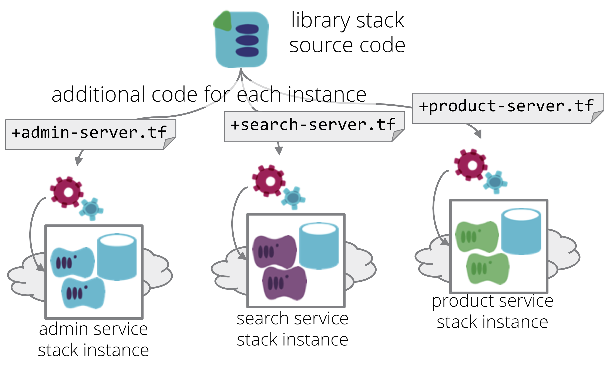

Mutant Stack Instances use a single [infrastructure stack](/patterns/stack-concept/) project to create multiple stack instances which are significantly different from one another. This is similar to the [template stack pattern](template-stack.html), in that a single stack project is used to create multiple instances, but whereas instances created from a template stack are highly consistent, mutant instances are not.

<figure>
  
  <figcaption>Mutant Stack Instances use a single infrastructure stack project to create multiple stack instances which are significantly different from one another.</figcaption>
</figure>

May be related to the [Swiss army module](swiss-army-module.html), where infrastructure code includes conditional logic that results in significantly different results depending on how it is configured.
