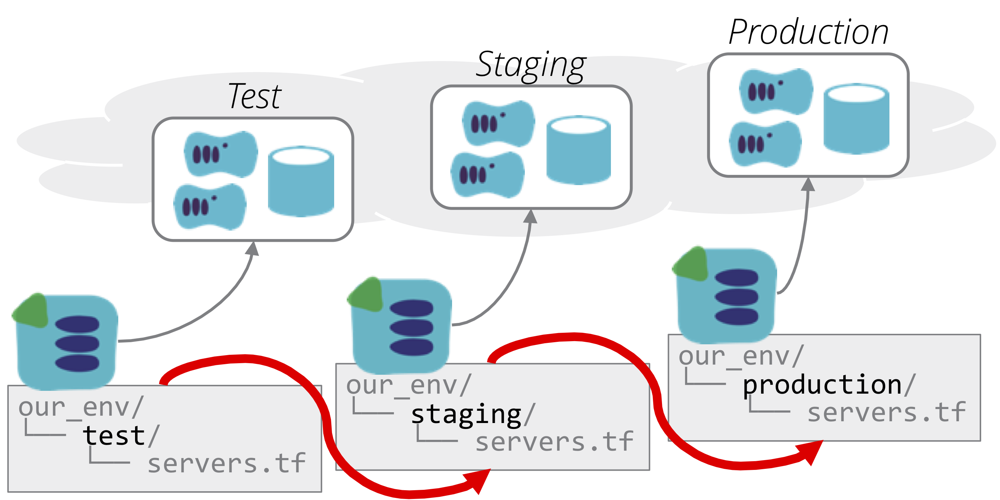
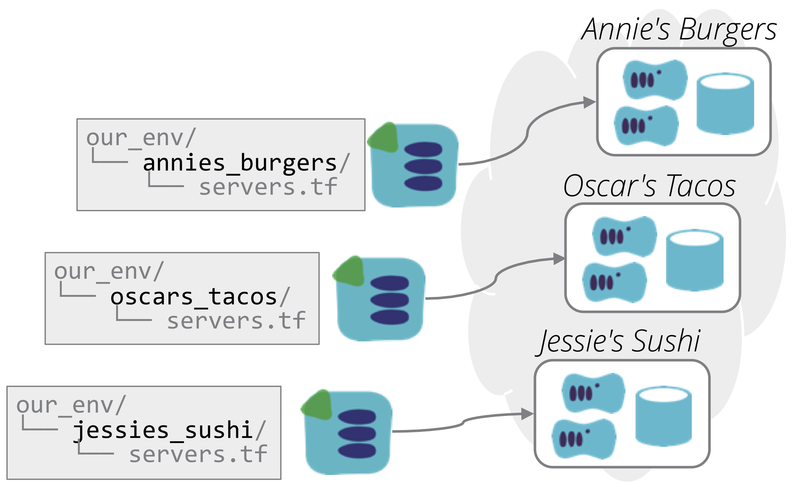

The Singleton Stack antipattern uses a separate copy of the stack source code project for each [infrastructure stack](/patterns/stack-replication/) instance.

So if there are three environments, _test_, _staging_, and _production_, there will be a separate copy of the infrastructure code for each of these environments. Changes are made by editing the code in one environment, and then copying the changes into each of the other environments in turn.

<figure>
  
  <figcaption>A singleton stack has a separate copy of the source code project for each instance.</figcaption>
</figure>

This is a fairly intuitive way to maintain multiple environments. It avoids issues with the more naive [multi-headed stack](/patterns/stack-replication/many-headed-stack.html) anti-pattern, because at least each environment has its own stack instance, reducing the blast radius of problems with a stack.

There are several problems with singleton stacks as an approach for multiple instances of the same infrastructure. One is that it increases the chances of errors. After a change is tested in one environment, it is copied into the code for the next environment. The change may not be copied correctly, especially if it actually involves changing the code in several places. The risk might be lower if the code can be completely replaced with the code from the environment.

<figure>
  
  <figcaption>Copying code from one project to the next may be harmful.</figcaption>
</figure>

But most often, there are differences between environments, even if it's different naming, identifiers, and/or tags. For example, the web server may be `web-test` in one environment, and `web-staging` in the next. It's hard to prevent human error in these cases, and mistakes can result in systems becoming tangled across environments.

And because each instance has its own infrastructure code, it's all too easy for significant differences to creep in, whether it's because of mistakes, unfinished work in one environment, or the expedience of just hacking the code in an environment where there is a problem.

Drift between instances becomes a different type of problem when singleton stacks are used to replicate the same infrastructure for different products, customers, or services. For example, if your business provides a hosted service for fast food companies, you might create a separate copy of the codebase for each one.

<figure>
  
  <figcaption>Singleton stacks for separate product instances.</figcaption>
</figure>

What typically happens in these cases is that each change needed for one customer is made in the separate copy of the code. Over time, the differences between these stacks becomes so great that it is hard to roll out fixes or other improvements to all of them. Each change that should be applied to all customers becomes a significant effort, carefully tested one by one, and in many cases, implemented differently for each customer.

This problem becomes even worse as the business scales to many customers and/or products. Maintaining multiple copies of stack code is annoying for 3 or 4 customers. For 10, 50, 100, or more it is simply unworkable.

So the main challenge with singleton stacks is they make it difficult to keep instances consistently configured. In cases where stack instances are meant to represent the same stack, the [template stack pattern](/patterns/stack-replication/template-stack.html) is usually more appropriate. These are particularly helpful when you need to strictly minimize variations between each instance - particularly important for scaling to very large numbers of instances. In other cases, where there is a need to enable more variation between instances, a [library stack](/patterns/stack-replication/library-stack.html) is probably more appropriate.

