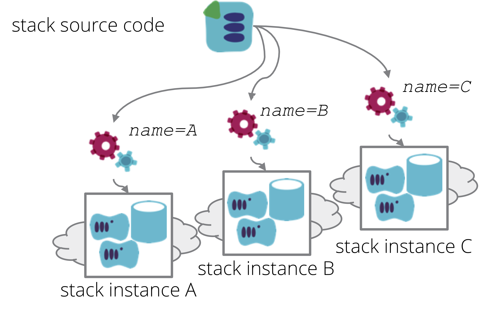

A Template Stack is an [infrastructure stack](/patterns/stack-concept/) source code project that is designed to be used to create multiple instances of the same thing. This is in contrast to [singleton stacks](singleton-stack.html), where a separate copy of the source code is maintained for each stack instance, and the [many headed stack](many-headed-stack.html), where multiple environments are all included in a single stack.

## When to use it

One of the reasons for defining infrastructure as code is to make it easy to replicate the infrastructure. This has a variety of uses, including:

- *Consistency* - use the same stack source code to create each environment used for testing new releases of software, as well as the production environment, to ensure accurate testing,
- *Testability* - when making a change to infrastructure code, provision and test an instance of it before applying the change to production environments,
- *Availability* - when a system fails, provision a new instance on demand to replace it,
- *Scalability* - provision additional instances of infrastructure in different locations,
- *Multiple customers* - provision an additional instance of an essentially identical service for each customer,

In all of these cases, consistency is a key goal. We want to be confident that we can make a change to the source code for the stack, test the change in one instance, and then easily apply new version of the code to all of the other instances of the stack.

<figure>
  
  <figcaption>A Template Stack is an infrastructure stack project that is designed to be replicated consistently.</figcaption>
</figure>

## How to implement it

A defining characteristic of the template stack pattern is that there is very little variation between each instance of the stack. Therefore, implementations of this pattern should aim to minimize the scope for variance.

Variance between stack instances is enabled by the use of [stack parameters](/patterns/stack-configuration/). The stack code specifies a number of parameters which can be set. For each stack instance, values are passed for these parameters, which the code uses to customize the instance.

Typically, parameters are used to define names and IDs to distinguish the elements of each instance from one another. This is particularly useful to avoid clashes between instances of infrastructure. For example, it may not be possible to create more than one subnet called `myAppSubnet`, so it would be useful to have a parameter named `INSTANCE_NAME`, and use this to name the subnet `myAppSubnet-${INSTANCE_NAME}`.

Parameters may also be used to vary sizing, for example creating different minimum and maximum cluster sizes, or different size servers.

In cases where there is greater variation between instances of a stack, either the template stack may not be the appropriate pattern, or else more thought may be needed to adhere to the pattern and keep a clean architecture. As a rule, the parameters used to define differences between stack instances should be very simple - strings, numbers, or in some cases lists. Additionally, parameters should not cause significant differences in which code is applied.

It is a red flag when a parameter is used as a conditional that decides whether to create large chunks of infrastructure. An example would be a parameter that indicates whether or not to provision a database cluster. If some instances require a database, and some do not, it may be preferable to split the database cluster into its own stack. The decision is then taken at a higher level of which stacks to provision. This keeps each stack simple, and easier to test.

## Alternatives

Some teams use the [singleton stack anti-pattern](singleton-stack.html) to manage multiple instances of a stack. This involves creating a new copy of the stack code for each new environment or other instance. While this is a straightforward approach to implement, it makes it difficult to keep each instance consistent.

A variation of the singleton stack is the [wrapper stack pattern]. Like the singleton stack, there is a separate copy of the stack code for each stack instance. However, the bulk of the infrastructure code is contained in a [stack module](/patterns/stack-replication/stack-code-module.html), a library which is imported into the stack project. This way the code is declared once - in the module - and re-used across each stack instance. Each stack project is effectively used as a mechanism to define parameter values for one stack instance.

## Considerations

Variations between instances created from a stack source code project create friction for rolling out changes to them. A change made to the project may work on some instances, but not others. This adds to the work needed to design, test, and debug changes to the code, which decreases the frequency and safety of changes.

### Testing infrastructure stack code

When making changes to an infrastructure stack's code, being able to provision a test instance enables you to test your changes before applying them to the production instance of the stack. As an individual engineer making changes to infrastructure code, you can provision and test your changes on your own sandbox instance before committing changes. As a team, you can use [Continuous Integration](https://martinfowler.com/articles/continuousIntegration.html) and [Continuous Delivery](https://martinfowler.com/bliki/ContinuousDelivery.html) to facilitate a consistent and reliable process for testing and delivering changes to your infrastructure. There are a number of considerations for [testing infrastructure changes] effectively, which will be defined in future patterns.

### Delivering changes to infrastructure stacks

Software development teams often use Continuous Delivery pipelines to test and release changes to their software. Infrastructure teams can follow this practice, ensuring that changes to stack source code, and other infrastructure code, are delivered rapidly and reliably using pipelines. Patterns for doing this will be published here later.
