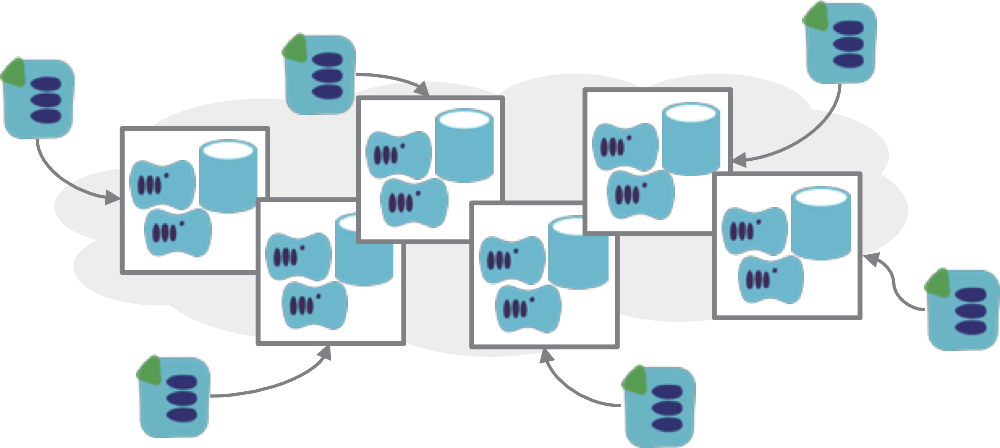
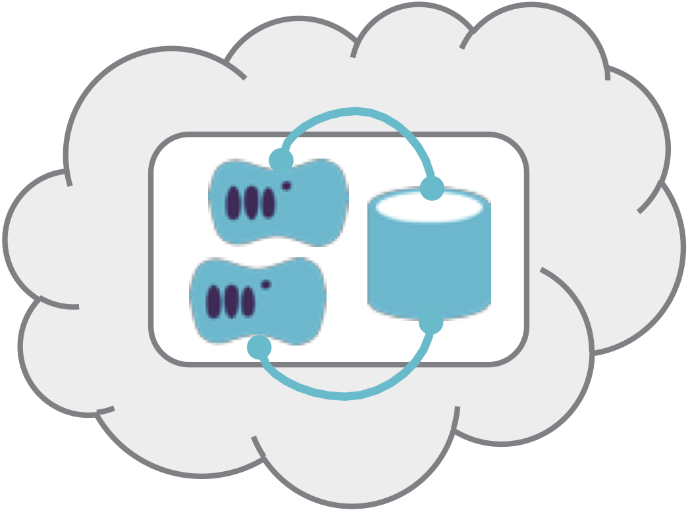

A key challenge with infrastructure design is deciding how to size and structure [stacks](/patterns/stack-concept/). The infrastructure for a given system may be defined as a single stack, or spread across multiple stacks. Shared code may also be used across stacks.

It's very common to start by defining infrastructure in a single stack. However, this tends to grow over time, and can become an unmanageable [monolithic stack](monolithic-stack.html).

<figure>
  
  <figcaption>Figure 1. A Monolithic Stack is an infrastructure stack that includes too many elements, so that it is difficult to work with.</figcaption>
</figure>

The other end of the spectrum is the [micro stack](micro-stack.html) pattern, which divides the infrastructure into small, loosely coupled stacks that can be easily changed independently.

<figure>
  
  <figcaption>Figure 2. Micro stacks are small, loosely coupled infrastructure stacks.</figcaption>
</figure>

Deciding on appropriate sizing and boundaries for splitting stack is a particular challenge. One common strategy is the [single service stack pattern](single-service-stack.html), where each stack includes the infrastructure specific to a particular application or service.

<figure>
  
  <figcaption>Figure 3. A Single Service Stack defines the infrastructure specific to a single application in its own infrastructure stack.</figcaption>
</figure>

An alternative is [cross-stack service](cross-stack-service.html), where the infrastructure to run a single application is broken out across multiple stacks, for example splitting web servers, application servers, database servers, etc. each into their own stack.

<figure>
  
  <figcaption>Figure 4. A Cross Stack Service has its infrastructure split across multiple stacks.</figcaption>
</figure>

In the other direction, multiple services are run in a single [multi-service stack](multi-service-stack.html). For example, a number of applications may combine to provide a single overall service, such as search, in which case it could make sense to combine them in a single infrastructure stack, although this risks becoming a monolith.

<figure>
  
  <figcaption>Figure 5. A Multi-Service Stack hosts multiple applications in a single instance of the infrastructure stack.</figcaption>
</figure>

Shared nothing stacks take the single service pattern to the extreme of ensuring that stacks do not have dependencies on other stacks. More commonly, stacks do have dependencies, for example a service stack's infrastructure may use networking structures managed by another stack. Stack integration patterns is an important topic in infrastructure design.

It is common to simplify infrastructure design by having a stack provide infrastructure used by other stacks. Another technique is to share common infrastructure code as a [stack module](/patterns/stack-concept/stack-code-module.html), imported into multiple stack projects.
