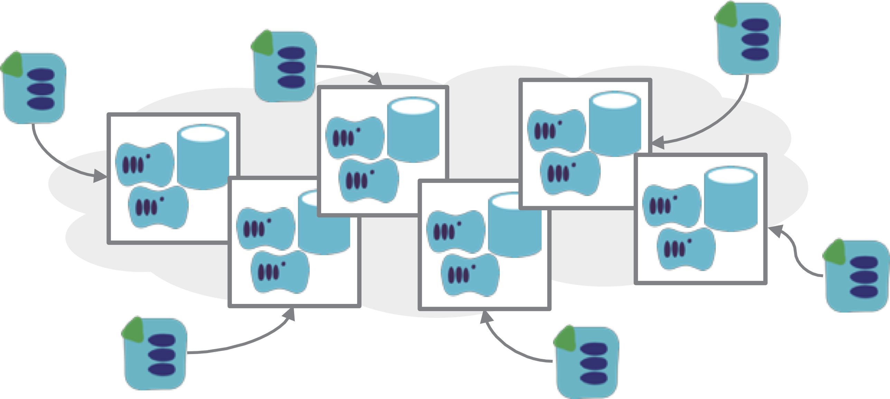

The Micro Stack pattern involves dividing a system into multiple, loosely coupled [infrastructure stacks](/patterns/stack-concept/), so that it is easy manage them independently.

<figure>
  
  <figcaption>Micro stacks are small, loosely coupled infrastructure stacks.</figcaption>
</figure>

## When to use it

Designing (or evolving) infrastructure into multiple, smaller stacks is a useful way to keep system design loosely coupled and easier to change. Changing a smaller stack is easier than changing a larger one, because it is easier to understand the impact of the change, simpler to test, and takes less time to debug issues.

It is also quicker to provision and test smaller stacks. This can be useful where there is a need to quickly create instances of a stack. For example, spinning up new instances may be a strategy for rapid scaling, for scaling across regions, for redundancy, or for provisioning instances on demand for particular purposes.

Another use of smaller stacks is when different parts of a system have different scaling requirements. Traffic to a user registration service may not experience surges in demand, whereas a product browsing service does, so pulling these into separate infrastructure stacks creates the flexibility to scale one service without needing to replicate the infrastructure for the other.

## Considerations

This architectural style is heavily influenced by [microservices](https://martinfowler.com/articles/microservices.html), and many of the same forces, principles, and practices apply.

## Related patterns

The appropriate sizing of stacks is dependent on the situation. Micro stacks are the opposite end of the spectrum from a [monolithic stack](monolithic-stack.html), where all of the infrastructure for a system is defined in a single stack.

A [multi-service stack](multi-service-stack.html) is a step away from a monolith, where each stack contains the infrastructure for multiple, related applications. [Single service stacks](single-service-stack.html) define the infrastructure specific to one particular application or service in each stack.

Breaking things down to the next level, a [cross-stack service](cross-stack-service.html) splits the infrastructure for a single application across multiple stacks, for example splitting web servers, application servers, database servers, etc. each into their own stack.

