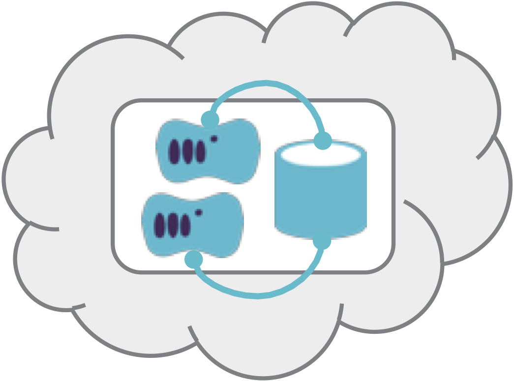

A Single Service Stack defines the infrastructure specific to a single application in its own
[infrastructure stack](/patterns/stack-concept/).

<figure>
  
  <figcaption>A Single Service Stack defines the infrastructure specific to a single application in its own infrastructure stack.</figcaption>
</figure>

## Also Known As

- Stack per app

## Motivation/Applicability

Aligning the stack directly to the infrastructure for each application or service means updates and other changes can be applied to it without directly affecting the infrastructure for other services. This is in contrast with a [multi-service stack](multi-service-stack.html), where the scope for a change may include infrastructure for other applications.

## Consequences

Limiting the scope for a change to one application reduces the scope of release coordination needed across applications and/or teams, which enables simplifying change management processes. These boundaries also help to keep code ownership clear, define the scope of testing, and make it easier to manage dependencies, keeping code decoupled.

## Related Patterns

The [multi-service stack pattern](multi-service-stack.html) takes the [micro-stack](micro-stack.html) concept further, splitting different infrastructure elements for an application across multiple stacks.
